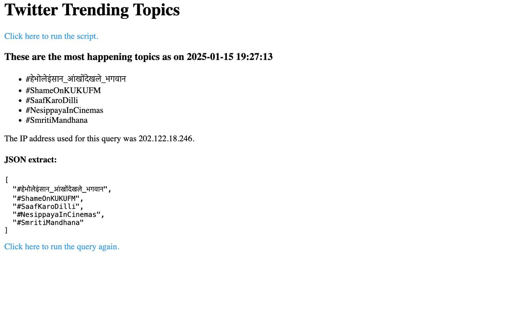

# Twitter Trends Scraper

A Flask-based web application that automatically scrapes trending topics from Twitter/X and stores them in MongoDB. The application uses Selenium for web scraping and provides a simple web interface to view the results.

## Features

- Automated login to Twitter/X
- Handles Twitter security challenges
- Scrapes top 15 trending topics
- Stores results in MongoDB with timestamp and IP address
- Web interface to view results
- Cross-platform compatibility
- Automated browser opening
- CORS support for API access

## Prerequisites

- Python 3.7+
- Google Chrome browser
- MongoDB Atlas account
- Twitter/X account

## Installation

1. Clone the repository:

```bash
git clone <repository-url>
cd twitter-trends-scraper
```

2. Install required packages:

```bash
pip install -r requirements.txt
```

3. Create a `.env` file in the project root with the following variables:

```env
TWITTER_USERNAME=your_twitter_username
TWITTER_PASSWORD=your_twitter_password
TWITTER_EMAIL=your_twitter_email
MONGO_PASSWORD=your_mongodb_password
MONGO_USER=your_mongodb_username
MONGO_CLUSTER=your_cluster_url
```

## Project Structure

```
twitter-trends-scraper/
├── app.py              # Main application file
├── requirements.txt    # Python dependencies
├── .env               # Environment variables
├── templates/         # HTML templates
│   └── index.html    # Main page template
└── README.md         # Project documentation
```

## Dependencies

- Flask
- Selenium
- pymongo
- python-dotenv
- requests
- webdriver-manager

## Usage

1. Start the application:

```bash
python app.py
```

2. The application will automatically open your default web browser to `http://localhost:5000`

3. Click the "Run Script" link to start scraping trending topics

4. Results will be displayed on the web interface and stored in MongoDB

## Error Handling

The application includes several error handling mechanisms:

- Automatic retry for failed scraping attempts
- Security challenge handling
- Cross-platform browser compatibility
- Multiple fallback URLs
- Comprehensive error logging

## Troubleshooting

If you encounter a 403 error:

1. Check your firewall settings
2. Try running with administrator privileges
3. Verify port 5000 is available
4. Clear browser cache
5. Try alternative URLs:
   - http://localhost:5000
   - http://127.0.0.1:5000
   - http://0.0.0.0:5000

## MongoDB Setup

1. Create a MongoDB Atlas account
2. Create a new cluster
3. Get your connection string
4. Add MongoDB credentials to `.env` file
5. Ensure your IP address is whitelisted in MongoDB Atlas

## Recording and Screenshot of the working Application

[text](<Screen Recording 2025-01-15 at 7.25.41 PM.mov>)


