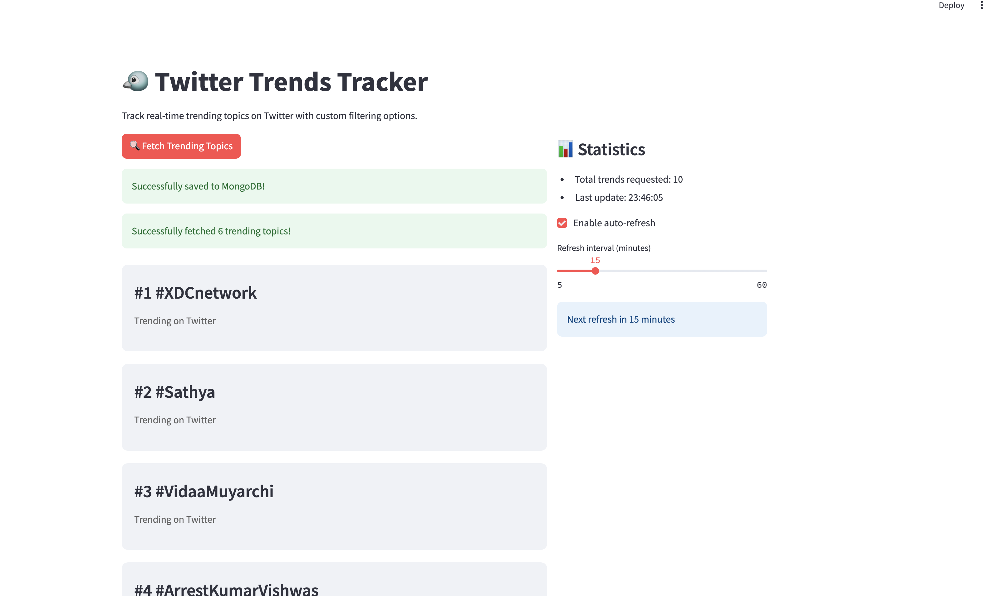

# Twitter Trends Tracker

A Streamlit-based application that scrapes and displays real-time trending topics from Twitter. The app features a user-friendly interface, customizable trend counts, and optional MongoDB integration for data persistence.

## 🌟 Features

- Real-time Twitter trends scraping
- Customizable number of trending topics (5-15)
- Beautiful card-based UI for trend display
- Progress tracking with visual feedback
- Optional MongoDB integration for data storage
- Auto-refresh capability
- Visible browser automation option

## 🛠️ Prerequisites

- Python 3.7+
- Chrome browser installed
- Twitter account credentials
- MongoDB connection details (optional)

## 📦 Installation

1. Clone the repository:

```bash
git clone <repository-url>
cd streamlit
```

2. Create a virtual environment (optional but recommended):

```bash
python -m venv venv
source venv/bin/activate  # On Windows, use: venv\Scripts\activate
```

3. Install required packages:

```bash
pip install streamlit selenium webdriver-manager pymongo python-dotenv requests
```

## 🚀 Usage

1. Run the Streamlit app:

```bash
streamlit run app.py
```

2. In the sidebar, enter your:

   - Twitter username
   - Twitter email
   - Twitter password
   - MongoDB credentials (optional)

3. Configure your preferences:

   - Number of trending topics to display
   - Browser visibility option
   - Auto-refresh settings

4. Click "Fetch Trending Topics" to start scraping

## 🔧 Configuration Options

### Twitter Settings

- Username: Your Twitter/X account username
- Email: Email associated with your Twitter account
- Password: Your Twitter account password

### Display Settings

- Number of trends: Choose between 5-15 trending topics
- Show Browser: Toggle browser window visibility during scraping
- Auto-refresh: Enable automatic trend updates

### MongoDB Settings (Optional)

- Username: MongoDB database username
- Password: MongoDB database password
- Cluster URL: Your MongoDB cluster URL

## 🗃️ Data Storage

If MongoDB credentials are provided, the app stores:

- Timestamp of data collection
- IP address of the collector
- List of trending topics

## Screenshot of the working Application


